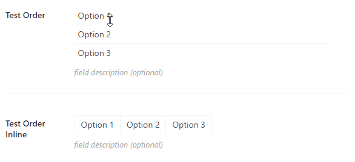

# CMB2 custom field "order"

Custom field for [CMB2](https://github.com/WebDevStudios/CMB2) to store custom order of options.



```php
add_action( 'cmb2_admin_init', 'cmb2_order_metabox' );
function cmb2_order_metabox() {

	$prefix = 'your_prefix_demo_';

	$cmb_demo = new_cmb2_box( array(
		'id'            => $prefix . 'metabox',
		'title'         => __( 'Test Metabox', 'cmb2' ),
		'object_types'  => array( 'page', 'post' ), // Post type
		// 'show_on_cb' => 'your_prefix_show_if_front_page', // function should return a bool value
		// 'context'    => 'normal',
		// 'priority'   => 'high',
		// 'show_names' => true, // Show field names on the left
		// 'cmb_styles' => false, // false to disable the CMB stylesheet
		// 'closed'     => true, // true to keep the metabox closed by default
	) );

	$cmb_demo->add_field( array(
		'name'          => __( 'Test Order', 'cmb2' ),
		'desc'          => __( 'field description (optional)', 'cmb2' ),
		'id'            => $prefix . '_order',
		'type'          => 'order',
		// 'inline'        => true,
		'options'       => array(
			'option-1'  => __('Option 1', 'cmb2'),
			'option-2'  => __('Option 2', 'cmb2'),
			'option-3'  => __('Option 3', 'cmb2'),
		),
	) );

}
```

## Changelog

### 1.0.1
* Sortable now works on Appearance >> Widgets

### 1.0.0
* Initial commit